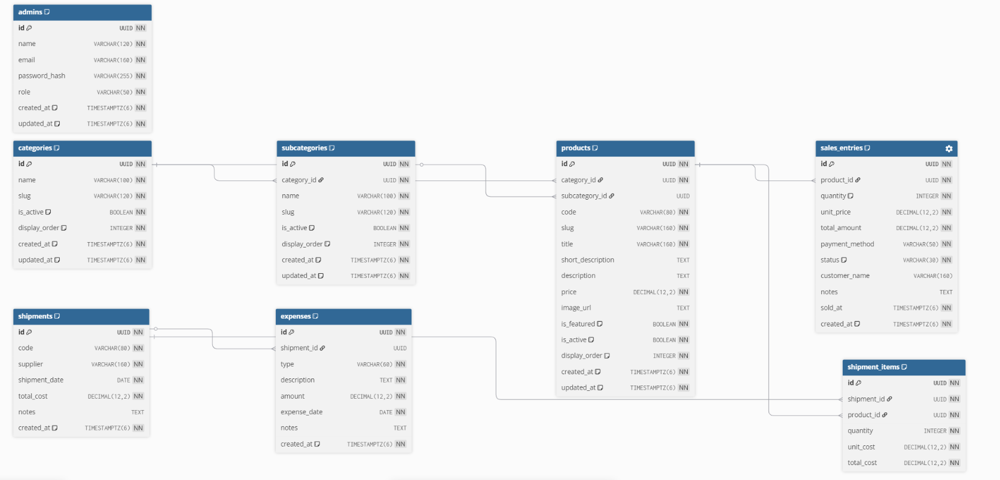
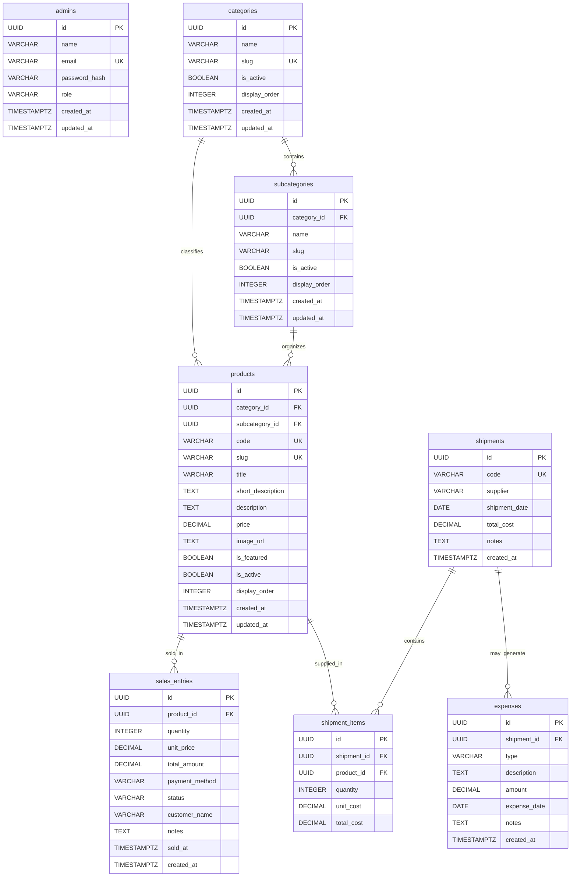

# ERD do Banco de Dados

## Objetivo

Este documento existe para facilitar a visualizacao estrutural do banco sem depender de leitura direta do `schema.prisma` ou da migration SQL.

Ele deve ser usado junto com:

- `apps/backend/prisma/schema.prisma`: fonte de verdade da modelagem no projeto
- `apps/backend/prisma/migrations/20260420_init/migration.sql`: export SQL atual do schema relacional

## ERD oficial

Link oficial do diagrama no dbdiagram:

- https://dbdiagram.io/d/ERD-Eloc-69e910651bbca0331216d664

Imagem versionada no repositorio para consulta rapida:

Observacao:

- a imagem serve como referencia visual rapida
- o link do dbdiagram serve como versao navegavel
- o `schema.prisma` e a migration continuam sendo a fonte de verdade estrutural

## Qual arquivo usar como export SQL

O projeto ja possui um export SQL valido para gerar ERD em ferramentas externas:

- [migration.sql](../../apps/backend/prisma/migrations/20260420_init/migration.sql)

Esse arquivo contem:

- criacao de tabelas
- chaves primarias
- indices
- constraints
- foreign keys

Se voce quiser importar o banco em uma ferramenta como dbdiagram.io, DBeaver, DataGrip ou outra solucao de modelagem, esse arquivo e o ponto mais fiel ao schema relacional atual.

## Leitura rapida do dominio

O banco hoje esta organizado em quatro blocos principais:

- autenticacao administrativa: `admins`
- catalogo: `categories`, `subcategories`, `products`
- operacao comercial: `sales_entries`
- operacao de abastecimento e custo: `shipments`, `shipment_items`, `expenses`

## ERD em Mermaid

## Observacoes importantes de modelagem

- `products.subcategory_id` e opcional, entao um produto pode existir vinculado apenas a uma categoria.
- `expenses.shipment_id` e opcional, entao uma despesa pode existir sem remessa associada.
- `shipment_items` funciona como tabela associativa entre `shipments` e `products`, mas com atributos proprios de custo e quantidade.
- `sales_entries` representa registro manual administrativo de venda, nao um fluxo completo de pedido.
- `admins` nao possui relacao direta com as tabelas operacionais neste momento; ele representa autenticacao e autorizacao do painel.

## Como usar este material

Fluxo recomendado para visualizacao:

1. usar a migration SQL para importar o schema em uma ferramenta de ERD
2. usar este documento como leitura humana rapida das relacoes
3. validar qualquer mudanca estrutural no `schema.prisma` antes de atualizar o ERD

## Regra de manutencao

Sempre que houver mudanca estrutural no banco:

1. atualizar `apps/backend/prisma/schema.prisma`
2. gerar ou revisar a migration correspondente
3. atualizar este arquivo se a relacao entre entidades tiver mudado
